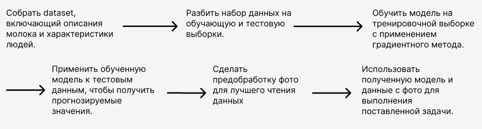
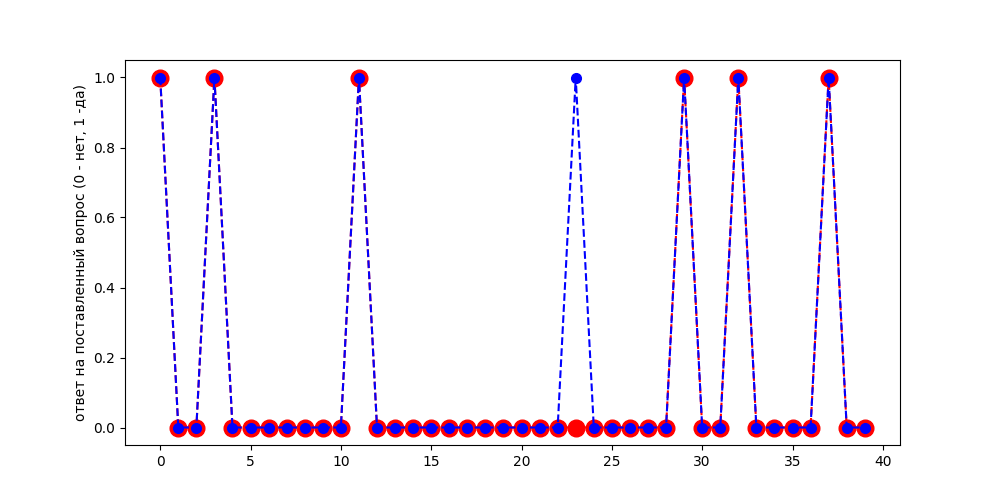
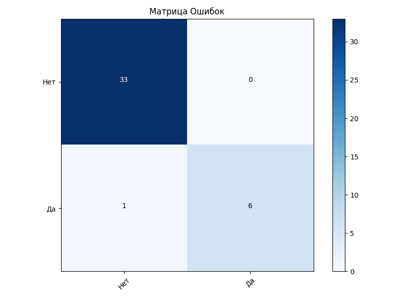

# Проект по машинному обучению
## Постановка адачи
### Задача

Имеются показатели содержания белков, жиров, углеводов и калорийность в молоке, а также характеристики человека (рост, вес, возраст, наличие аллергии на лактозу, пол). На основе этих данных необходимо определить, рекомендуется ли человеку употреблять молоко.

### Формализаия задачи

Дано:
- Параметры молока:
    - белки
    - жиры
    - углеводы
    - калорийность
- Характеристики конкретного человека:
    - рост
    - вес
    - возраст
    - аллергия на лактозу
    - пол

На выход: ответ на вопрос "рекомендуется ли человеку употреблять молоко" - (Да\Нет)

## План работы:

- Собрать dataset, включающий описания молока и характеристики людей.
- Разбить набор данных на обучающую и тестовую выборки.
- Обучить модель на тренировочной выборке с применением градиентного метода.
- Применить обученную модель к тестовым данным, чтобы получить прогнозируемые значения.
- Сопоставить прогнозируемые значения с фактическими данными тестовой выборки, чтобы оценить точность работы модели.
- Собрать фотографии молока
- Сделать предобработку фото для лучшего чтения данных 

- Использовать полученную модель и данные с фото для выполнения поставленной задачи.

## Результаты:

